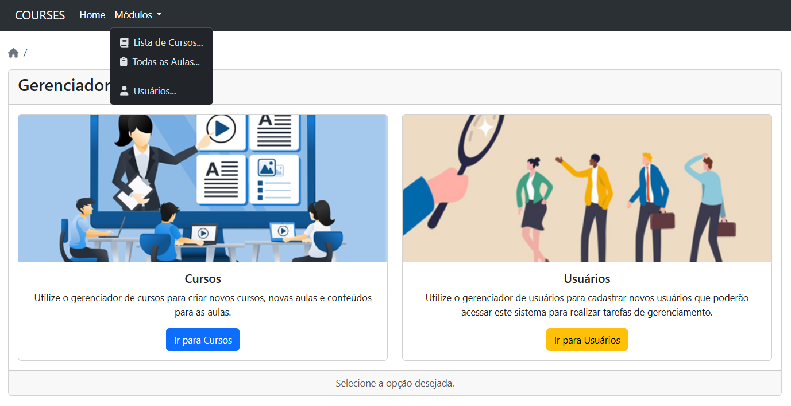
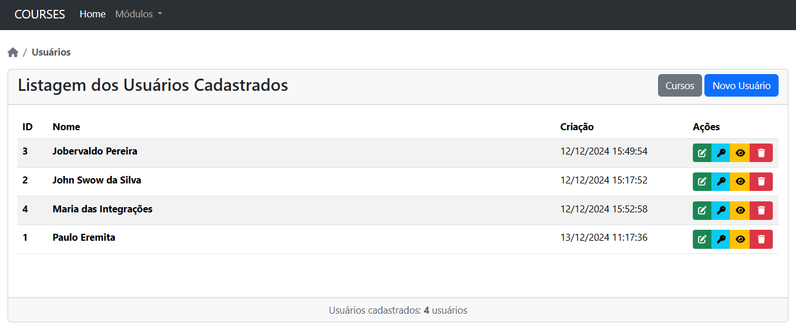
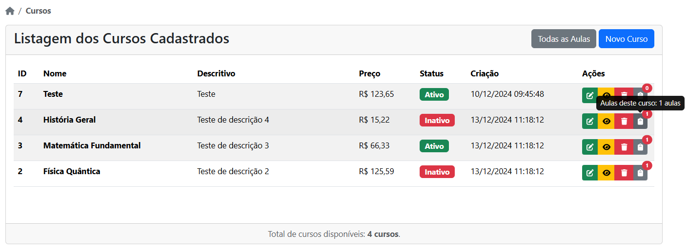
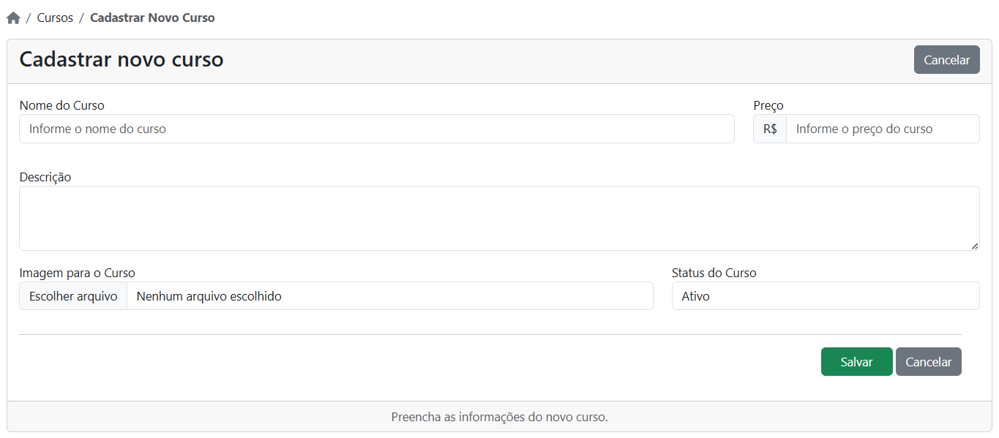

# Laravel 10x Project

The objective of this project is to study the features and tools of Laravel 10x.
I developed this project based on a course I completed. Following the project idea from the course, I made improvements and added new features to practice and test some resources of Laravel 10.x.
I hope you appreciate this project and that it helps you in your studies.

## Screenshots for your enjoyment

### Home Page

### User List

### Course List

### User Registration

